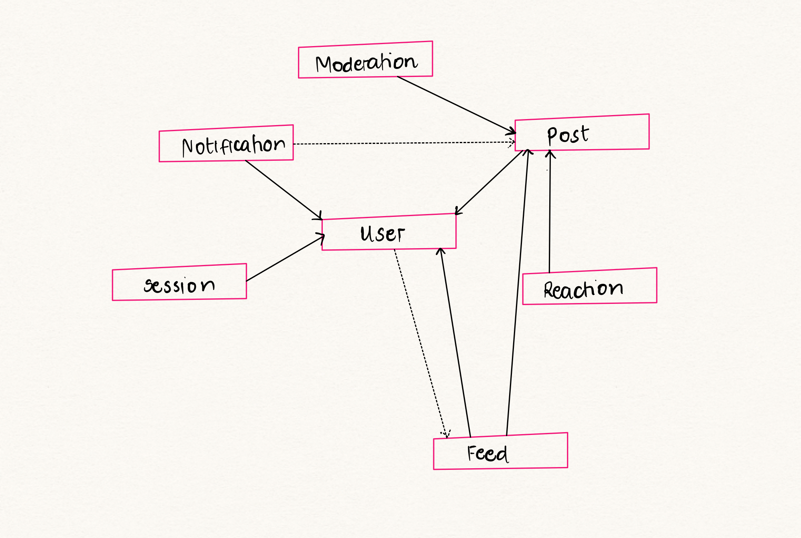

<style>
    summary {
       font-size:20px 
    }
</style>

# Assignment 3: Convergent Design :mag:

## UpLift Pitch :sun_with_face: :speech_balloon: 

**"Turn your dark days into light:bulb:. Find joy, share your story, and lift your spirit with UpLift!"** :sparkles:

We all know the internet can sometimes be a bit of a downer—endless negativity, bad news, and harsh comments can easily ruin your mood. But don't let that bring you down. UpLift is here to be your happy place—a community dedicated to positivity, support, and spreading good vibes. When life throws its challenges at you, we’re here to help you bounce back and stay lifted.

With UpLift, you’ll find a space to brighten your day and connect with others who are on the same journey to find joy. Share your story or read inspiring ones from others in ***UpLift Stories***:high_brightness:. Need a little extra boost? Dive into the ***Compliment Carousel***:revolving_hearts:, where you can give and receive kindness with just a few taps. If you’re facing a tough moment, the ***Support Circles***:open_hands: are there for you—where real people offer real encouragement and advice. And when you need to unwind, the ***Aawww Feed*** :heart_eyes_cat: is packed with heartwarming photos and videos guaranteed to make you smile.

To help you stay grounded, you’ll also have access to a ***Gratitude Journal***:pray:, a private space for you to reflect on what you're grateful for and keep those positive vibes alive. Plus, ***Daily Uplift Notifications***:love_letter: will start your day with affirmations and give you gentle reminders to reflect before bed—helping you stay positive from morning to night.
At UpLift, you’re not just another user—you’re part of a community that cares. Let’s make the internet a brighter, kinder place—together.

## Concepts :page_with_curl:

<details>

<summary><b>Concept 01 &#128100;</b></summary> 

<b>Concept:</b> User

<b>Purpose:</b>Authenticate users and register their preferences for topics (support circles) and affirmation needs.

<b>Operational Principle:</b>  After a user registers with a username, password, and preferences, they can authenticate as that user by providing a matching username and password.
 

<b>State</b>
>registeredUsers: set User
>
>username: registeredUsers -> one String
    
<b> Actions </b>

```
register (n:String, p:String, pref: set String, out u: User)
    u not in registeredUsers
    registeredUsers += u 
    u.username := n
    u.password := p
    u.preferences := pref
 ```

 ```
 authenticate (n:String, p:String,  out u: User)
      u in registeredUsers
      u.username = n && u.password = p  
 ```

</details>

<details>

<summary><b>Concept 02 &#127760;</b></summary> 

<b>Concept:</b> Sessioning [User]

<b>Purpose:</b>Maintain an authenticated session, allowing the user to stay logged in and perform activities.

<b>Operational Principle:</b>  After a user registers with a username, password, and preferences, they can authenticate as that user by providing a matching username and password.

<b>State</b>
> active: set Session
>
>user: active -> one User

<b> Actions </b>

```
start(u: User, out s: Session) 
    s not in active;
    active += s;
    user.s := u;
 ```
 ```
  getUser (s: Session, out u: User)
    s in active
    u := s.user
```
 ```
 end(s: Session) 
    active -= s;
 ```


</details>

<details>

<summary><b>Concept 03 &#128173;</b></summary> 

<b>Concept:</b> Post[User,Content]

<b>Purpose:</b>Allow users to author update content that can either be shared publicly or saved privately.

<b>Operational Principle:</b>  After a user authors content (a post), they can choose to either share it publicly or save it privately in their journal.


<b>State</b>
> postsToBePosted: set Post // Posts waiting for moderation
>
> feedPosts: set Post // Public posts in the feed
>
> journalEntries: set Post  // Private posts in journal entries
>
>content: (feedPosts + journalEntries) -> one Content // Map posts to their content
>
>feedName: feedPosts,postsToBePosted -> one String // Map feedPosts to the names of feeds


<b> Actions </b>

```
createPost(u: User, content: Content, private: bool, out p: Post) {
    // Adds post to  postsToBePosted or journalEntries based on the private flag 
     if is to be shared to public (i.e private = false), post will be added to postsToBePosted
     else added to journalEntries
}
 ```
 ```
editPost(p: Post, newContent: Content) {
    // Updates the content of the post
}
```
 ```
getPosts(feedName: String, out posts: set Post) {
    // Returns posts from the feed matching the given feedName
}
 ```
 ```
 viewJournalEntries(out journalEntries: set Post) {
    // Returns all posts that are private (journal entries)
}
```
 ```
 deletePost(p: Post) {
    // Removes the post from either feedPosts or journalEntries
}
```
```
publishPost(p:Post) {
    // Publishes post to feed by moving posts from postsToBePosted
    to feedPosts
}
```

</details>

<details>

<summary><b>Concept 04 &#128241;</b></summary> 


<b>Concept:</b> Feed[User]

<b>Purpose:</b>Organize public posts according to related topics.

<b>Operational Principle:</b>  After a user authors content (a post), it can be shared publicly by being placed into a specific topic-based feed. Users can view and explore posts in various feeds based on their interests.


<b>State</b>
>feeds: set Feed, // All predefined feeds in the system
>
>posts: Feed -> set Post, // Map feeds to the posts they contain
>
>feedName: Feed -> one String // Map feeds to their predefined names


<b> Actions </b>

```
getFeedPosts(feedName: String, out posts: set Post) {
    // Returns the set of posts for the specific feed
}
 ```
 ```
viewAvailableFeeds(out feeds: set Feed) {
    // Returns the set of all available feeds
}
```

</details>

<details>

<summary><b>Concept 05 &#129303;</b></summary> 

<b>Concept:</b> Reaction[User]

<b>Purpose:</b> Allow users to react to posts with predefined emotional responses, crowdsourcing approval and offering encouragement and support to the author

<b>Operational Principle:</b> After viewing a post, users can express their emotional support or approval by selecting from a predefined set of reactions.


<b>State</b>
>availableReactions: set Reaction // All possible predefined reactions
>
>postReactions: Post -> set Reaction // Map posts to the reactions they receive
>
>reactionType: Reaction -> one String // Map each reaction to its predefined type 
>
>reactionCount: Post -> Reaction -> one Int // Track counts of each type of reaction per post

<b> Actions </b>

```
addReaction(p: Post, r: Reaction) {
    // Adds the selected reaction to the post and increments the reaction count
}
 ```
 ```
removeReaction(p: Post, r: Reaction) {
    // Removes the reaction from the post and decrements the reaction count
}
```
 ```
getReactionCounts(p: Post, out counts: set (Reaction -> Int)) {
    // Returns the counts of each type of reaction for the post
}
 ```

</details>


<details>

<summary><b>Concept 06 &#128232;</b></summary> 


<b>Concept:</b> Notification

<b>Purpose:</b>Send reminders to users about tasks or activities at specific times.

<b>Operational Principle:</b>  After a user selects the times they wish to be notified about an activity or reminder, notifications will be sent at those designated times.


<b>State</b>
>pendingNotifications: set Notification // Track notifications that are pending delivery
>
>deliveredNotifications: set Notification // Track notifications that have been sent
>
>notificationContent: Notification -> one String // The message or prompt to be delivered
>
>notificationTime: Notification -> one DateTime // Scheduled time to send notification 
>
>notificationType: Notification -> one Task // Type of task to be notified for (eg journaling)

<b> Actions </b>

```
scheduleNotification(content: String, time: DateTime, task: Task, out n: Notification) {
    // Schedules a new notification with the specified content, time, and task type
}
 ```
 ```
deliverNotification(n: Notification) {
    // Moves the notification from pending to delivered once the scheduled time is reached
}
```
 ```
getPendingNotifications(out notificationsSet: set Notification) {
    // Returns the set of notifications that are pending delivery
}
 ```
 ```
getDeliveredNotifications(out notificationsSet: set Notification) {
    // Returns the set of notifications that have been delivered
}
```


</details>

<details>

<summary><b>Concept 07 &#128110;&#127997;</b></summary> 


<b>Concept:</b> Moderation[Posts]

<b>Purpose:</b>Ensure all public content meets community guidelines and manage flagged content to maintain a positive atmosphere in the app.

<b>Operational Principle:</b>  After content(Posts) is created, the moderation system evaluates it against community guidelines. Content that violates these guidelines can be flagged for review, edited, or removed to preserve a positive environment


<b>State</b>
>flaggedContent: set Content // Tracks content flagged for moderation
>
>reviewedContent: set Content // Tracks content that has been reviewed
>
>contentFlags: Content -> one String // Stores flagging reason (e.g "inappropriate language")


<b> Actions </b>

```
flagContent(c: Content, reason: String) {
    // Adds content to flaggedContent with a reason for flagging
}
 ```
 ```
reviewContent(c: Content, outcome: String) {
    // Moves content from flaggedContent to reviewedContent with a review outcome 
        (e.g., remove, edit)
}
```
```
removeContent(c: Content) {
    // Deletes content from the system if it violates guidelines
}
 ```

</details>

## Concept Synchronizations :arrows_counterclockwise:

#### Login

```
sync login(u: User, n: String, p: String, out s: Session)
    if User.authenticate(n, p, u) 
        Session.start(u, s)
        // User is now logged in with an active session
    else 
        throw Error ("Login failed: Invalid username or password. Please try again.")


```


#### Logout
```
sync logout(u: User, s: Session)
    sessionUser =  Session.getUser(s, sessionUser)
    if sessionUser = u
        Session.end(s)
        // User successfully logged out
    else
        throw Error("Logout failed: This user is not associated with the current session.")


```

##### Creating a post
```
sync createPost( content: Content, privateFlag: Bool, out p: Post)
    u = User.getUser(u)
    if u != none
        Post.createPost(u, content, privateFlag, p)
        if privateFlag = false
            Moderation.flagContent(p, "Auto-check")
            oucome = Moderation.reviewContent(p.content)
            if outcome = "Passed"
                Post.publishPost(p)
            else if outcome = "Failed"
                Moderation.removeContent(p)
        
        // Private posts already handled in createPost
    else
        throw Error ("Post creation failed: Please log in to create a post.")
```

#### Reacting to a post
```
sync reactToPost(s: Session ,feedName: String, p: Post, r: Reaction)
    u = Session.getUser(s, u)
    if u != none
        posts = Feed.getFeedPosts(feedName, posts)
        if p in posts
            Reaction.addReaction(p, r)
            // Reaction successfully added to post
        else
            alert ("Reactions are not allowed on private journal entries.")
    else
        throw Error ("Reaction failed: Please log in to react to posts.")

```

#### Creating a Notification
```
sync createNotification(s: Session, content: String, time: DateTime, task: Task)
    u = Session.getUser(s, u)
    if u != none
        Notification.scheduleNotification(content, time, task, n)
        // Notification scheduled successfully
    else
        thow Error ("Notification scheduling failed: Please log in to schedule notifications.")
```

#### Sending a Notification
```
sync sendPendingNotifications()
    Notification.getPendingNotifications(notificationsSet)
    for each n in notificationsSet
        if Notification.notificationTime[n] <= currentTime() 
            && n not in Notification.deliveredNotifications
            Notification.deliverNotification(n)

```


## Dependency Diagram :pencil:

  

## Wireframes :notebook_with_decorative_cover:

 <a href="#">Interactive Prototype for UpLift</a>

 <a href="https://www.figma.com/design/QY3JA04hAwcsLAkioi4RXR/UpLift?node-id=0-1&t=j5jo2bIiq205yO8F-1">Figma Wireframes for UpLift</a>

## Design Tradeoffs :part_alternation_mark:


#### 1. Privacy vs. Accountability (No Anonymous Posting)
I chose not to include anonymous posting to ensure accountability and reduce harmful behavior. While this decision fosters a more         responsible community, it may discourage users who want to share sensitive stories privately. 

**Rationale:** Prioritizing user safety and accountability aligns with the app's goal of maintaining a positive environment, even if it reduces user anonymity. 

#### 2.Public Interaction vs. Private Conversations (No Chat Feature)
 Excluding a chat feature limits the potential for private one-on-one interactions. This could frustrate users seeking more personal support but keeps the app focused on public, uplifting interactions. 
 
 **Rationale:** Public interactions align with the app’s mission of spreading positivity widely, avoiding the complexities and potential toxicity of private chats.
 
#### 3. Predefined Feeds vs. User-Created Feeds
 Predefined feeds simplify the user experience but limit user control over the organization of content. While user-created feeds could enhance personalization, they would add complexity in terms of moderation and app design.

**Rationale:** Predefined feeds ensure easier content management and a more streamlined user experience, while maintaining focus on key topics.

#### 4. Limited Notifications (Journaling and Affirmations Only)
Notifications are limited to journaling and affirmation reminders to prevent user dependency and over-engagement. This decision helps users focus on self-care and positivity without the app pulling them in constantly.

**Rationale:**  By restricting notifications to essential features, the app encourages mindful use, reinforcing the idea that it is a supportive tool, not an attention-seeking platform.


