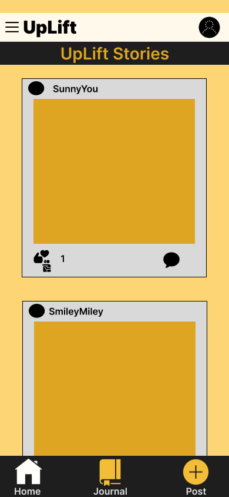
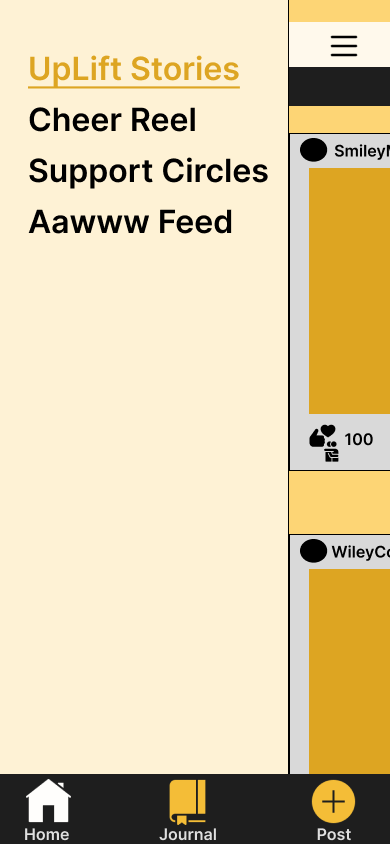
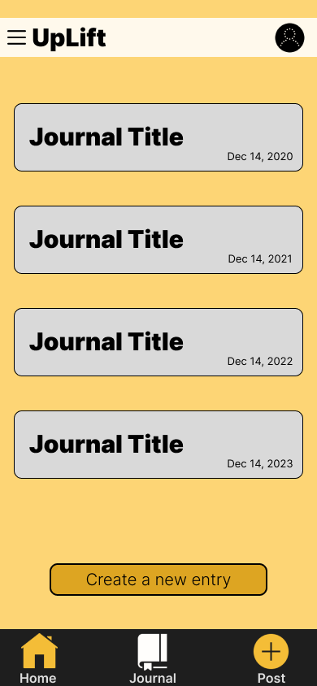
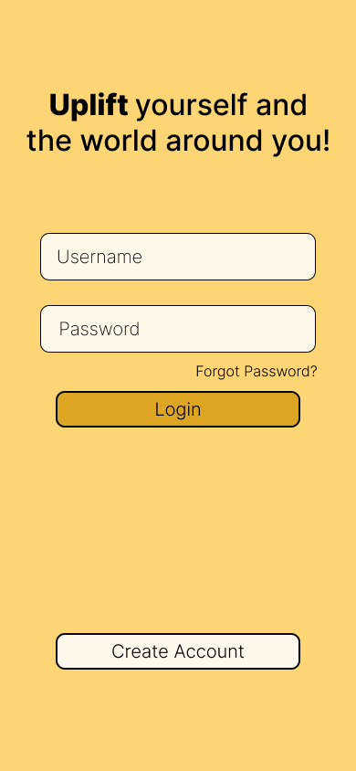
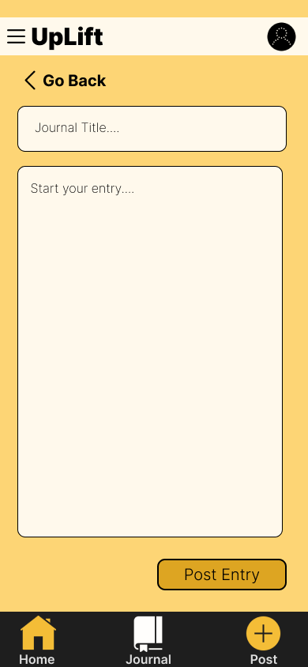
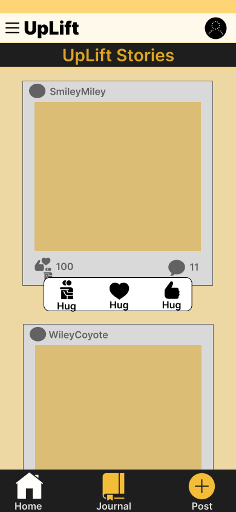
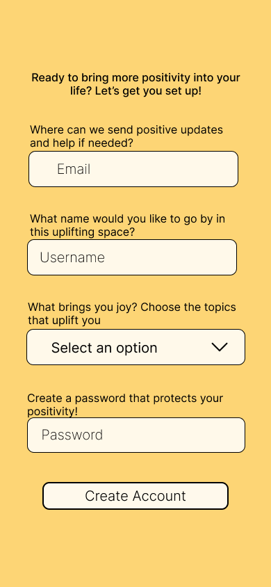

# Assignment 5:  Frontend Design & Implementation :mag:

## Heuristic Evaluation :microscope: 

### Usability Criteria :page_with_curl:

1. <h4>Discoverability &#129300;</h4>
UpLift wireframes show a clear intention to make the primary actions easy to discover, drawing on familiar design patterns from popular apps, but there are areas where improvements could enhance the user experience further.

<b>Wireframe Observation 1</b>

In the first wireframe (feed and navigation), the layout follows familiar patterns from popular social media platforms like Instagram and Facebook. This ensures that many users will find the primary actions—such as posting, liking, and commenting—easy to discover and use. The buttons for posting and navigation are placed in intuitive locations (a bottom navigation bar) that are standard in many apps. However, the lack of a visible report icon for posts is a gap in discoverability, especially since the app's goal is to crowdsource positive contributions and flag inappropriate content. Introducing a clear "Report" button next to reactions and comments would allow users to help moderate content more effectively.

<b>Wireframe Observation 2</b>

In the second wireframe (sidebar with various feeds), the primary navigation remains clear and familiar. The hamburger menu is a recognizable symbol for the sidebar, which aligns with user expectations. However, one area that could benefit from refinement is the notifications or profile button at the top right. Currently, its purpose is unclear. Is it for profile settings or notifications? This ambiguity might confuse users, making it less discoverable. Clarifying the purpose with a clearer icon (e.g., a bell for notifications, a user icon for profile settings) or adding a label would improve usability.

<b>Wireframe Observation 3</b>

In the third wireframe (journal entries), there are a few points where discoverability could be improved. First, the "Create a new entry" button is placed at the bottom of the page, which forces users to scroll past all entries to find it. This might make it less discoverable. Moving the button to the top or using a floating action button would align with user expectations and improve efficiency. Additionally, placing new entries at the top rather than the bottom would make it easier for users to find their latest activity.

2. <h4>Pleasantness &#129303;</h4>

The UpLift wireframes prioritize pleasantness through thoughtful color choices, simplicity, and emotional connection, which are crucial in creating an interface that is both calming and enjoyable for users.

<b>Color Choices</b>

The primary color scheme centers around a light yellow (#FDD575), chosen for its associations with joy, warmth, and positivity. This color was selected based on psychological studies linking yellow to feelings of happiness and optimism, which align with the app’s mission to uplift users. The use of white for text fields and posts provides a calming contrast, creating a soothing interface. However, while yellow is generally uplifting, overusing it or using a more saturated tone could evoke feelings of frustration or anxiety. The decision to use a softer, baby yellow helps avoid this pitfall, ensuring a more pleasant and balanced visual experience.

<b>Layout Simplicity</b>

The wireframes adopt a minimalistic layout, ensuring that users are not overwhelmed by cluttered elements. This clean design supports a calm, focused user experience where only the essential elements are highlighted. The straightforward navigation and clear separation of content allow users to interact with one task at a time, reducing cognitive load. For instance, the bottom navigation bar is limited to just a few key actions (Home, Journal, Post), ensuring that users are not bombarded with too many options, which is critical for maintaining a stress-free interface.

<b>Positive Emotions Evocation</b>

The reaction icons—heart, thumbs-up, and hug—are all designed to foster a sense of warmth and positivity in the interface. By using these universally understood and visually pleasing icons, the interface promotes supportive and encouraging interactions. The simplicity of the reaction choices reinforces the app’s mission to maintain a positive atmosphere, while also contributing to the aesthetic harmony of the interface. The combination of thoughtful iconography and soft, friendly labels helps users feel more connected to the content, while maintaining the overall calmness and encouraging nature of the app’s design. This focus on positive interaction adds to the pleasantness and emotional comfort of using the app.

### Physical Heuristics :muscle:

1. <h4>Gestalt Principles &#129299;</h4>
When it comes to applying Gestalt Principles, the wireframes demonstrate a clear intention to apply key design principles that enhance the user’s visual experience and ensure a natural flow of interaction. The overall layout supports a clean and minimalist design, but there are areas where leveraging Gestalt principles more effectively can strengthen the interface's visual cohesion and user experience. With a few adjustments, the wireframes can better guide users through tasks while ensuring the interface feels cohesive and intuitive.

<b>Proximity</b>

In the top navbar of the UpLift wireframes, the menu icon and the UpLift logo are placed close together, which might imply they share similar or related functions. However, since the logo is not interactive while the menu opens a sidebar, this proximity could confuse users. A slight increase in spacing between the two elements could help clarify that these serve distinct purposes. Meanwhile, the profile icon is placed on the far right, creating clear visual separation from the menu and logo. This effective use of proximity suggests the profile icon performs a different function, such as accessing profile settings or notifications. The spacing reinforces this separation and improves discoverability without overwhelming users with unnecessary clutter.

Further down, the secondary title (which indicates the current feed) is placed close to the top, immediately following the navbar. This positioning effectively signals its importance as a secondary navigational cue, but slightly increasing the distance from the navbar could enhance the user experience by reducing visual clutter and emphasizing its distinct purpose. Moving into the feed itself, proximity is used to group the reaction icons (hearts, hugs, thumbs) and comment icons beneath each post. This grouping works well, as it intuitively indicates to users where they can interact with posts, aligning with familiar social media patterns. The closeness of these icons to the content also ensures that users can efficiently engage with posts, thereby improving efficiency and creating a seamless interaction flow.

At the bottom of the wireframe, the bottom navigation bar has a slightly wider spacing between icons, indicating their different functions while maintaining their group identity as navigation tools. This balance in spacing helps users distinguish between the home, journal, and post options while still understanding that these are part of the same navigational system. Here, proximity aids in distinguishing actions without overwhelming the user. Overall, proximity is used effectively in most parts of the wireframes, but minor adjustments, particularly in the top navbar and secondary title, could further enhance clarity and improve the user experience by reducing potential ambiguities.

<b>Similarity</b>

In the UpLift wireframes, the principle of similarity is applied consistently across various interface elements to ensure users can easily identify related actions. For instance, all action buttons—such as Login, Create a New Journal Entry, and Post Entry—share the same design characteristics, including rectangular shapes, consistent color schemes, and hover feedback. This uniformity helps users quickly understand that these buttons serve similar purposes, guiding them through key interactions like logging in or adding new content. The visual consistency across these buttons contributes to a cohesive user experience, making it intuitive to navigate through different sections of the app without confusion.

The bottom navigation bar also makes excellent use of similarity, with the icons for Home, Journal, and Post being identical in size, shape, and placement. This creates a unified visual language that reinforces their related functions as part of the app's main navigation system. Users can immediately recognize these elements as tools for navigating between different parts of the app, which improves ease of use and quick accessibility. Similarly, in the sidebar, the app highlights the current feed (such as Cheer Reel or Support Circles) by underlining and using a different color for inactive feeds, clearly signifying the user’s current position. This application of similarity ensures users can effortlessly distinguish between selected and unselected options, enhancing navigation clarity and flow.

Although reaction buttons (such as hearts, thumbs, and hugs) serve a different purpose from action buttons, they maintain a consistent design style that visually groups them together. This uniformity makes it clear to users that these buttons are for interacting with posts, enhancing the sense of familiarity. While the current use of similarity is strong across these elements, further improvements could include adding slight animations or subtle changes in color when users engage with buttons to create a more interactive and dynamic experience. This would reinforce the app’s responsive feel, particularly in areas where user engagement is key, like reacting to posts.

<b>Figure/Ground</b>

The principle of figure/ground is essential in UI design for helping users identify key interactive elements by separating them from their background. In the UpLift wireframes, this principle is evident in how the interface components are visually distinguished from their surroundings, ensuring that users can quickly and intuitively identify where they need to interact.

On the login screen, the figure/ground principle is effectively applied. The username and password input fields, along with the Login and Create Account buttons, stand out against the light yellow background. The white input fields and solid colored buttons are clearly distinct from the background, making it easy for users to understand where to input their credentials and which buttons to press. This high contrast makes the interactive elements feel like the foreground (figure) while the rest of the screen recedes into the background (ground). The clear visual separation makes it obvious where the user should focus.

In the journal entry page, the journal entries themselves are treated as individual figures, placed within distinct gray boxes that contrast with the light yellow background. This design makes it easy for users to understand that each journal entry is a separate, clickable element. The "Create a new entry" button also stands out clearly as a figure against the background, ensuring users know where to go to create a new entry. This clear differentiation between figure and ground helps guide the user’s attention and makes navigation smoother.

In the feed wireframe, posts are treated as figures and are set against a neutral gray background, which contrasts with the light yellow surroundings. The reaction and comment icons are clearly defined figures below each post, standing out from the post container to signify interaction points. This ensures users immediately understand that these icons are interactive, aligning with familiar social media patterns. However, there could be further improvement by adding more visual contrast, such as shadows or more distinct borders, to strengthen the figure/ground distinction and improve user focus on critical elements.

2. <h4>Fitts' Law &#129488;</h4>

When applying Fitts' Law to the UpLift wireframes, the design largely supports easy access to interactive elements by ensuring that buttons and actions are well-sized and spaced. In the feed wireframe, the reaction buttons (hearts, hugs, thumbs) are prominent, making them easy to click with minimal effort. The placement directly below posts ensures that users can quickly respond with a reaction without unnecessary navigation, supporting efficient interaction. Similarly, the comment button is placed close to the reactions, further simplifying engagement with the post. These choices align well with Fitts' Law, as users don’t have to reach far, and the buttons are large enough to reduce errors.

<b>Wireframe Observation 1</b>

The journal wireframe also demonstrates good application of Fitts’ Law, with the Back button and Post Entry button clearly visible and large enough for easy interaction. Both buttons are placed in intuitive locations, and the spacing helps users navigate the page with minimal clicks. For instance, users can enter their journal title and entry in one seamless flow, ensuring that actions can be completed efficiently. The bottom navbar provides consistent navigation between major sections like Home, Journal, and Post, with icons that are large and spaced apart enough to avoid accidental clicks while still being easy to reach.

<b>Wireframe Observation 2</b>

In the sign-up wireframe, button sizes and input fields are well-designed for quick access, but the dropdown menu for selecting options presents a potential challenge. If the dropdown contains too many items, users may find it difficult to scroll through and select an option efficiently. Incorporating a search feature in the dropdown would address this, allowing users to jump directly to the desired selection rather than scrolling through a long list. Additionally, the placement of the hamburger menu next to the UpLift logo on the top left could cause accessibility issues. The proximity between these two elements may lead to users accidentally clicking the logo instead of the menu. Slightly increasing the distance between the two would make the menu easier to target and reduce confusion.

By minimizing the number of clicks required to perform primary tasks and ensuring buttons are appropriately sized, the UpLift wireframes demonstrate a thoughtful approach to user experience. With a few refinements, such as improving the proximity of the hamburger menu and adding search functionality to dropdowns, the overall ease of interaction can be further optimized.

### Lingusitic Level :speech_balloon:

1. <h4>Speaking User's Language &#128513;</h4>
The app's wireframes effectively use simple and approachable language that aligns with the user’s everyday vocabulary. Rather than relying on technical jargon, the app uses familiar and inviting terms such as Home, Post, Journal, and Feed to guide users through their experience. The tone is consistently warm and uplifting, particularly in areas like the signup page, where users are greeted with phrases like “Ready to bring more positivity into your life?” This framing not only simplifies the user experience but also reinforces the app’s mission to create a positive and encouraging environment. The wording is easy to understand and does not overwhelm users with overly complicated language, which is an excellent application of the Speak the User’s Language heuristic.

The naming of feeds, such as Cheer Reel and UpLift Stories, also reflects the app’s commitment to a positive user experience. These names are creative but still intuitive, ensuring that users quickly grasp the purpose of each section without needing an explanation. By naming these sections with a positive, fun tone, the app succeeds in speaking to its target audience in a way that is not only clear but also emotionally resonant.

However, one area for improvement is error handling and confirmation messages, which are currently missing in the wireframes. To maintain the positive and user-friendly tone, error messages should avoid technical language and instead offer encouragement. For example, instead of a basic “Field required” message, the app could say, “Oops! Looks like you missed something—let’s fill this out together!” Similarly, after a successful action, the app could use celebratory language, such as “Awesome! Your entry is posted—keep spreading joy!”

Additionally, providing context-specific guidance when users interact with journal entries or posts could further enhance the positive tone. For example, a friendly reminder like “You can jot down whatever brings you joy today” while creating a journal entry can maintain engagement and reflect the app’s mission to promote well-being.

2. <h4>Consistency &#128526; </h4>
UpLift’s wireframes show strong consistency in layout, color schemes, and typography. The light yellow background (#FDD575) with black and white accents is used uniformly across the app, creating a cohesive visual identity. This consistency extends to primary action buttons like Login, Create Account, and Post Entry, which share a similar size, shape, and color, making it easy for users to identify important actions.

Navigation icons for Home, Journal, and Post follow a consistent style, contributing to a predictable user experience. However, the profile icon in the top right could benefit from clearer labeling, as its function is currently ambiguous. Clarifying whether it leads to profile settings or notifications would enhance usability.

In terms of language, UpLift maintains a positive, inviting tone throughout, but this should be expanded to include error messages and confirmations. Phrases like “You’re all set!” for success or “Let’s try that again” for errors would help maintain the app’s friendly atmosphere, ensuring consistency across all interactions.

## Project Links

<a href="https://github.com/Nisha-Nathan/Uplift-frontend">Github Link</a>

<a href="https://uplift-frontend-6ouh5dfwe-nisha-nathans-projects.vercel.app/">Vercel Deployment</a>

