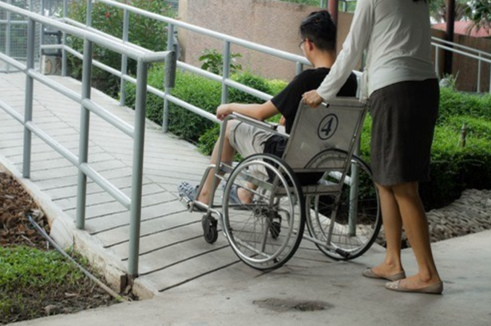
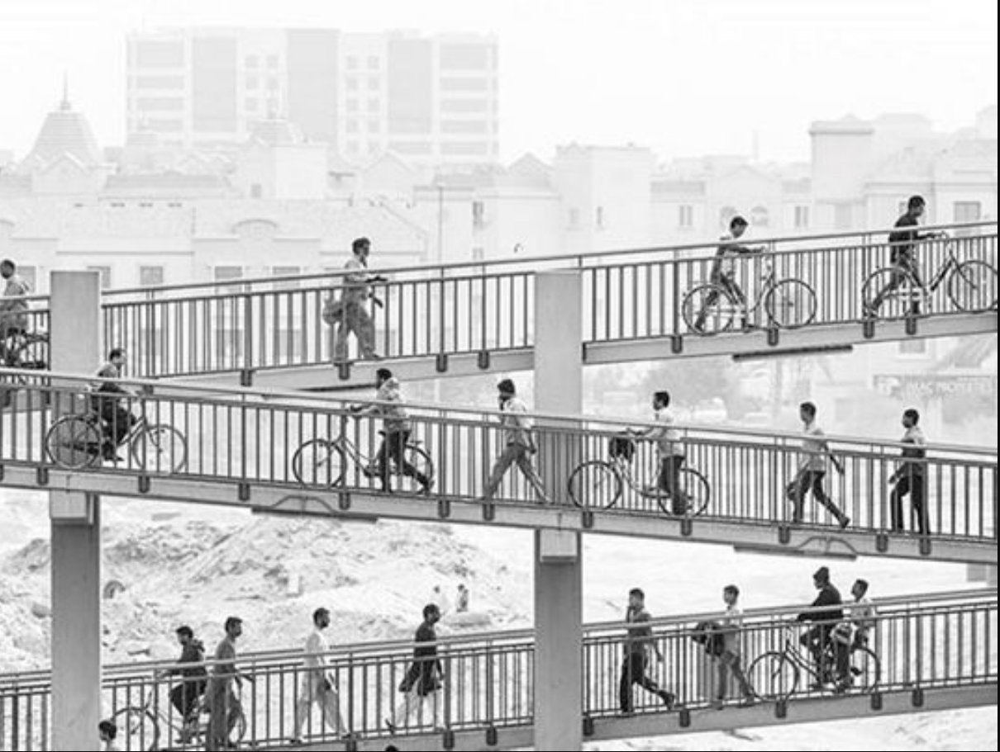
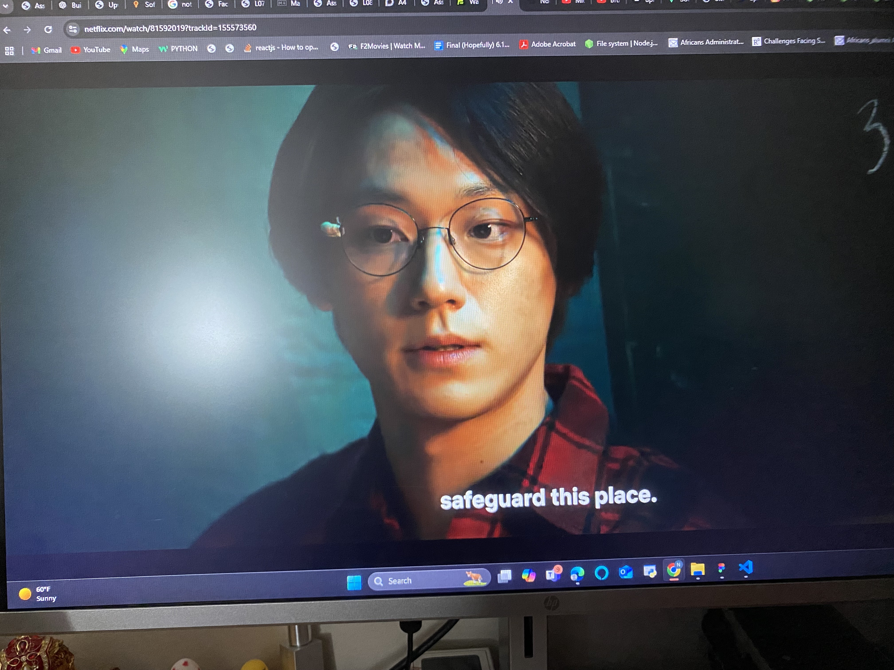

# How Designing for Accessibility Helps Everyone: Reflections from My Journey

When I think back to my work last summer, I’m reminded of how deeply it reshaped my understanding of accessibility in visual design. I was tasked with updating components from an older UI library to a newer version—one that made accessibility a top priority. It was the first time I had to consciously and consistently consider accessibility in my designs, and it had me reflecting on the larger benefits it offers—not just for those with disabilities but for all users.This realization wasn't entirely new to me. During my freshman year, I took a class called **Introduction to Design Thinking and Innovation (6.9021)**, where we studied how design choices meant for accessibility can enhance usability for everyone. Take ramps, for example—originally designed for wheelchair users, they also make life easier for people pushing strollers, carrying heavy carts, or using skateboards. This inspired me to look into how visual design practices that prioritize accessibility often create better experiences for everyone, and that's what I want to share today.

<figure>

<figcaption>A wheelchair user using a ramp</figcaption>
</figure>

<figure>

<figcaption>Several people walking and riding bikes on ramps</figcaption>
</figure>

## The Power of Accessibility Tools
Accessibility tools often seem like niche solutions, catering only to a subset of users—but when you take a step back, it’s clear that they do much more. Screen readers, for instance, help visually impaired users navigate apps and websites, but they also encourage us as designers to craft cleaner, more logical layouts that anyone can follow. Popular screen readers like NVDA and ChromeVox highlight the importance of clear, descriptive content—something that benefits users regardless of their vision.

Other tools like Apple VoiceOver or Orca go beyond helping users with impairments—they push us to improve our content’s semantic structure, which ultimately helps with things like SEO, ensuring our content is easy to understand for both people and algorithms. Accessibility considerations force us to be intentional: no ambiguous labels, no poorly placed buttons—everything has to make sense to both a screen reader and a user. This means everyone wins—faster navigation, better content comprehension, and a seamless experience for all.

## Designing for Extremes Benefits the Middle
It’s remarkable how solutions originally designed for people with specific needs have ended up helping everyone. Closed captioning is an excellent example. Originally created to make TV accessible for people who are deaf or hard of hearing, captions have become a staple in my own movie-watching routine, even when I’m watching in a language I fully understand. Captions make it easier to follow along, especially in noisy environments or when a character has an accent that’s hard to catch. What was once a specialized accessibility feature is now an everyday convenience.The same goes for electric toothbrushes, which were initially designed for individuals with limited motor skills and orthodontic patients. Now, they’re used by millions because they make brushing easier and more effective for everyone. By addressing the needs of those with unique challenges, we create innovations that improve the lives of many, often beyond their original purpose.

<figure>

<figcaption>My Current Netflix Watch(Sweet Home) With Captions</figcaption>
</figure>

## Visual Design for Accessibility Improves the Experience for Everyone
One of the key takeaways from my summer project was how considering accessibility could directly enhance visual design. Take the example of color contrast. Guidelines for accessible color contrast ratios, such as those recommended by the <a href="https://www.w3.org/WAI/standards-guidelines/wcag/">Web Content Accessibility Guidelines (WCAG)</a>, make interfaces more readable for visually impaired users. But they also make text easier to read for everyone—especially under harsh lighting or when using a mobile device outdoors. This simple design consideration reduces eye strain and enhances usability for a wider audience.

Another example is focus indicators. While these are primarily designed to assist users navigating with a keyboard or screen reader, they also make interfaces feel more responsive and intuitive for users who may simply prefer keyboard navigation over a mouse. This kind of feedback gives users, regardless of ability, more confidence in their actions, ultimately enhancing the experience for all.

## Conclusion: Designing with Empathy
Designing with accessibility in mind isn’t just about meeting compliance or accommodating a small subset of users—it's about designing with empathy and understanding that the edges of the spectrum can greatly inform the middle. By focusing on accessibility, we make visual design stronger, more inclusive, and ultimately more enjoyable for everyone. Just like how ramps benefit more than just wheelchair users, and electric toothbrushes help beyond their original intended users, accessibility in visual design serves us all.

The beauty of designing for accessibility is that we’re designing for people—real people with different needs, contexts, and preferences. And by doing so, we create experiences that are seamless, intuitive, and positive for all.
